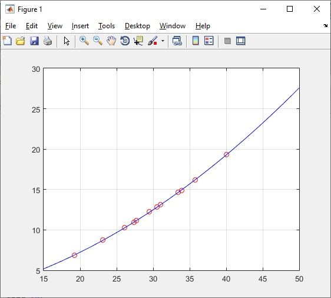
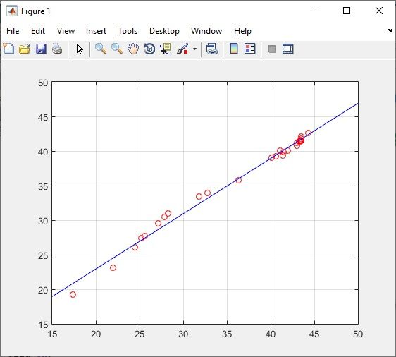
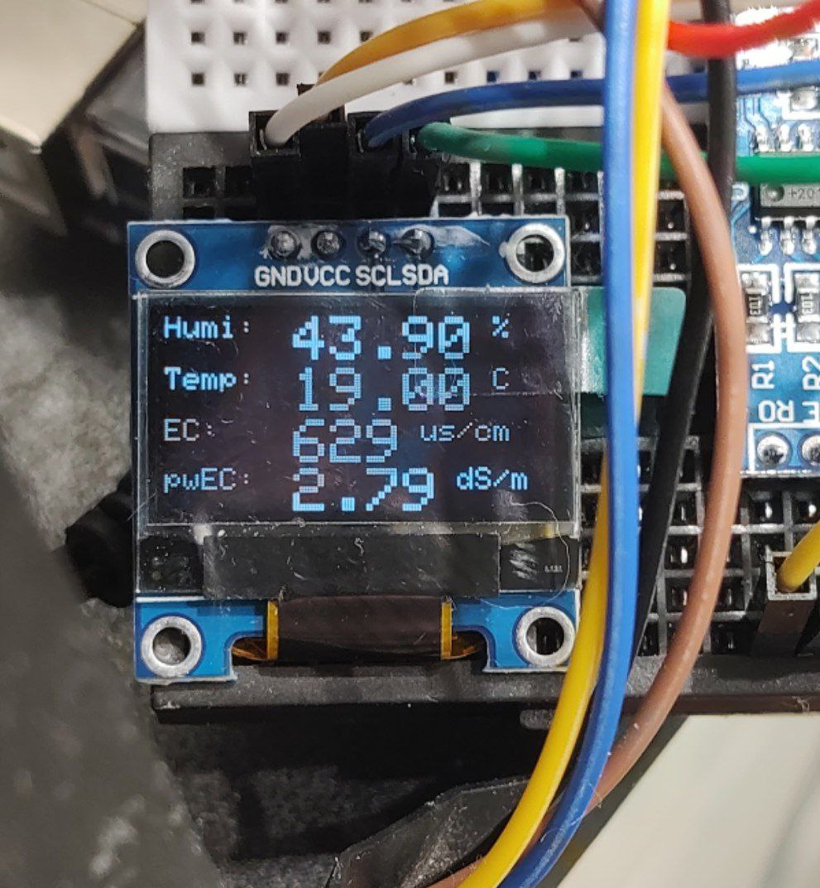
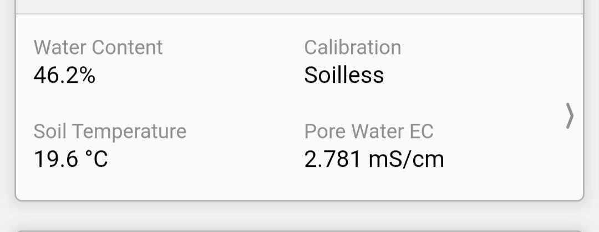
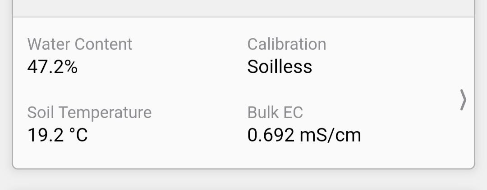
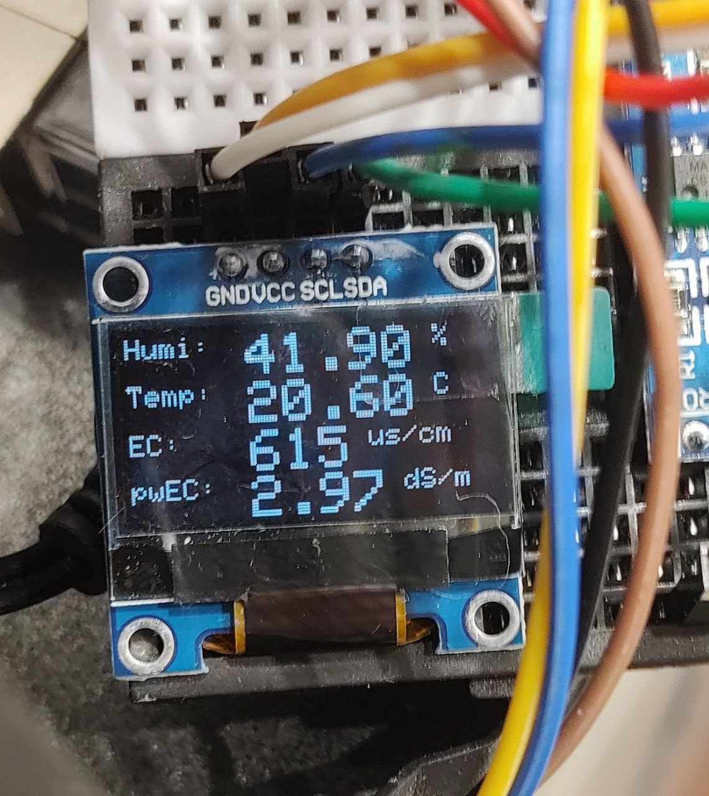
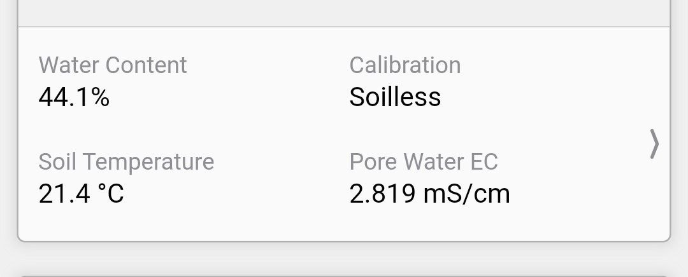
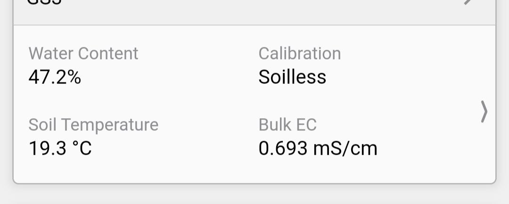
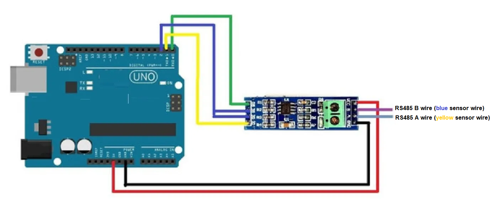
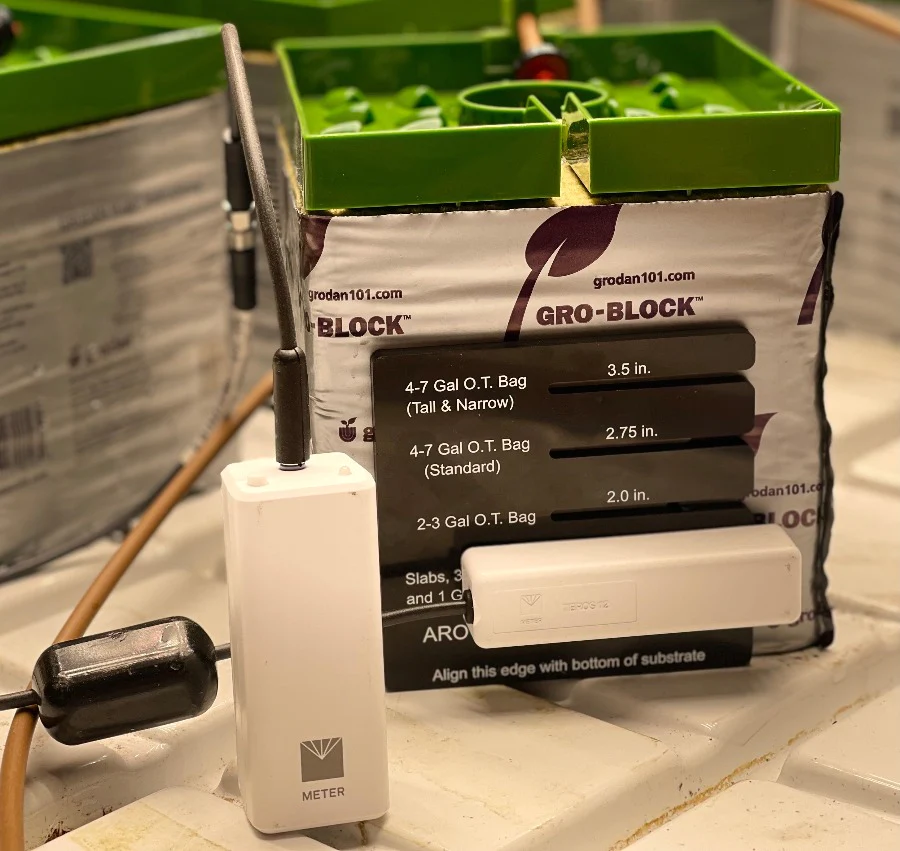

# Soil Sensor Calibration and Measurement

A tool to calibrate and measure pwEC with generic resistive sensors and Arduino.

_Leia em outros idiomas: [Português Brasileiro](README.pt-br.md)_

## Table of Contents

- [Introduction](#introduction)
  - [Data and analysis](#data-and-analysis)
- [Hardware](#hardware)
  - [Schematics](#schematics)
- [Programming](#programming)
- [Known Problems](#known-problems)
  - [Different sensor models and manufacturers](#different-sensor-models-and-manufacturers)
  - [Measurements between different sensors and sites](#measurements-between-different-sensors-and-sites)
  - [Sensor positioning (sensor alignment tool)](#sensor-positioning)
  - [Uniformity](#uniformity)
- [References](#references)
  - [Crop Steering References](#crop-steering-references)

### Introduction

This project arose from the need to use generic resistive sensors for use with [crop steering](#crop-steering-references).

In the practice of crop steering, the use of pore water EC (pwEC) measurements is very common, which is calculated from 
the measurement of dielectric permittivity 
([read more](https://www.metergroup.com/en/meter-environment/measurement-insights/tdr-fdr-capacitance-compared)), 
a functionality present only in more expensive professional sensors, like MeterGroup Teros 12.

In our case we would like to use more accessible soil sensors and compare the measurements with a Teros 12 in order to 
try to find some correlation in the measurements.

#### Data and analysis

For this, we recorded a series of 30 measurements of each sensor in a 
[spreadsheet](https://docs.google.com/spreadsheets/d/1E9GSEiDYnn_6L7qgtjaymDu83J8WYE-xgDbja41ro9Q/) for approximately 
10 days in order to find some pattern.

After some analysis and based on [some papers](#references), we made quadratic and cubic approximations with the data using Matlab.

 

So it looks like we managed to find a calibration. With a precision difference of VWC < 3% and bulk EC < 100 ppm, what we 
consider a satisfactory result:

_Generic sensor readings with Arduino_

_Teros 12 sensor readings with ZSC and Zentra app_

  

_Generic sensor readings with Arduino_

_Teros 12 sensor readings with ZSC and Zentra app_

### Hardware

You will need a resistive soil sensor that measures soil temperature, moisture, and conductivity (EC).

We used a soil sensor from [ComWinTop](http://www.comwintop.com/), model THC-S with RS485 interface. So take into account 
that all the calibration was done with this sensor. If you use other sensor models or from another manufacturers, it may 
be necessary to recalibrate and adjust the source code (soon we will release a method and tools for this).

[Sensor on AliExpress](https://pt.aliexpress.com/item/1005001524845572.html) (buy the THC-S model) 
[Manual and reader software](https://wiki20210805.oss-cn-hongkong.aliyuncs.com/download/sensors/Smart_Agriculture/CWT%20soil%20sensor%20manual.zip)  
[USB/RS485 Adapter](https://pt.aliexpress.com/item/33017179197.html) (Optional. If you want to take sensor measurements with a Windows PC via USB. Use that specific adapter. Others tested adapter models do not work!)  
[More resources about CWT sensor](http://www.comwintop.com/index.php?s=index/category/index&id=144)  

You will also need:
- Arduino of your choice (we use the Arduino Uno).
- [TTL to RS485 (MAX485) bidirectional module for Arduino](https://pt.aliexpress.com/item/32848382513.html).
- Breadboard.
- Jumper/dupont cables.
- [OLED Display module](https://pt.aliexpress.com/item/1005004971492089.html) (optional)

#### Schematics

- The sensor yellow wire goes in the `A` connector of RS485 module. 
- The blue wire go in the `B` connector of RS485 module. 
- The sensor black wire go in Arduino GND.
- Th sensor red/brown wire go in Arduino 5V.

### Programming

Just open Arduino IDE, load the [soil_sensor.ino](soil_sensor.ino) to your Arduino and watch
Monitor serial (default `115200` baud).

If you want a spot check that doesn't need a PC to take readings, use a display module. Here I used an 
Adafruit-like OLED Display module with 128x64 pixels. See [soil_sensor_display.ino](soil_sensor_display.ino) code.

### Known Problems

#### Different sensor models and manufacturers

As stated earlier, all calculations and software presented here were based on two specific sensors, ComWinTop THC-S and 
Metergroup Teros 12.

It is known that different sensors of the same type tend to have very close measurements, at least in the most accurate 
professional models. So it's possible that these calibrations will work with many resistive sensors similar to CWT's.

However, given the lower degree of accuracy, in addition to being generic sensors without a high manufacturing standard, 
it can happen that measurements are very different from expected. In that case, try to take your measurements and find a 
new calibration setting, send us a PR, and we'll be happy to test it. Or get in touch so that we can better explore and 
try to solve specific problems for each sensor.

#### Measurements between different sensors and sites

The main issue (perhaps with all sensors) is sensor stability in soil/substrate.

The sensor needs to be inserted into the compacted substrate (perhaps that's why it works better in rockwool) and avoid 
moving or removing it from the site as much as possible.

Once moved or removed and subsequently replaced, there is a high chance that the measurements will change. So the biggest 
challenge here is to position all the sensors so that the measurements are very close together. It's boring work, but 
possible. So be patient.

Also, different sensors may show different measurements depending on the position. In the case of the CWT THC-S and 
MG Teros 12, sensors used in this project, measurements were taken in the same pot/substrate with the sensors positioned 
at the same height and alignment. So if you take these precautions, you will probably have very close measurements 
between the sensors (see more below).

#### Sensor positioning

The measurements will vary depending on sensor positioning/height, that will vary depending on substrate type and volume. 
To solve this problem, Aroya developed a sensor alignment tool:

  

However, it is not necessary to have the tool. Below are the position recommendations:

| 4-7 Gallon O.T. Bag (Tall & Narrow) | 4-7 Gallon O.T. Bag (Standard) | 2-3 Gallon O.T. Bag | Slabs, 3"-6" Blocks, and 1 Gal O.T. Bag |
|---|---|---|---|
| 3.5 inches | 2.75 inches | 2.0 inches | 1.25 inches |

Simply measure with a rule from the base of substrate (not necessarily the base of pot or bag).

#### Uniformity

Coco is not a uniform substrate. Even rockwool has no that uniformity. That's the main factor on measurements differences 
caused by sensor positioning.

Watch Ramsey Nubani from Aroya talking more about this:

https://aroya.io/en/knowledge-base/crash-courses/uniformity

### References

- [[Meter Group] Soil moisture sensors - How they work](https://www.metergroup.com/en/meter-environment/measurement-insights/tdr-fdr-capacitance-compared)  
- [[Meter Group] Teros 11/12 Manual](assets/20587_TEROS11-12_Manual_Web.pdf)  
- [[Kameyama] Measurement of solid phase permittivity for volcanic soils by time domain reflectometry](assets/kameyama2008.pdf)  
- [[Gonçalves] Influence of soil bulk density in a dystroferric red ultisoil moisture estimated by TDR](assets/nitossolo.pdf)  
- [[G. C. Topp] Electromagnetic Determination of Soil Water Content](assets/topp1980.pdf)  
- [[Yasser Hamed] Evaluation of the WET sensor compared to time domain reflectometry](assets/hamed.pdf)
- [[Hilhorst] A Pore Water Conductivity Sensor](assets/hilhorst2000.pdf)

#### Crop Steering References

- [[Aroya] Crop Steering - The Ultimate Guide](https://aroya.io/en/resources/crop-steering)
- [[Growlink] The Growlink Ultimate Guide to Crop Steering](https://www.growlink.com/crop-steering)
- [[Trym] Crop Steering Cannabis](https://trym.io/crop-steering-cannabis/)
- [[FloraFlex] Crop Steering Series](https://floraflex.com/default/how-to-grow/crop-steering)
- [[Aroya] Uniformity](https://aroya.io/en/knowledge-base/crash-courses/uniformity)