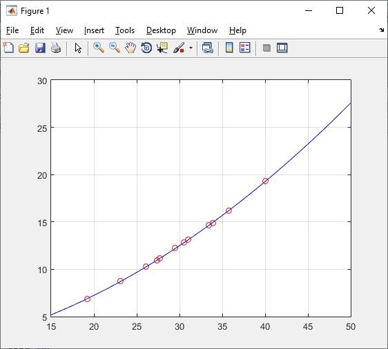
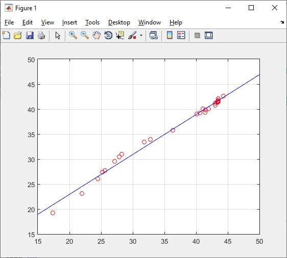
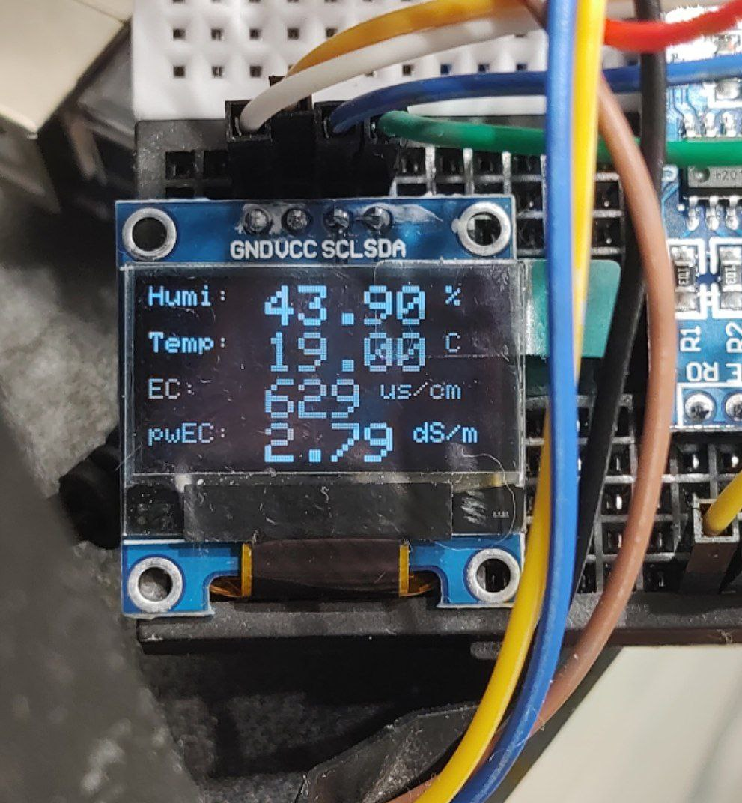
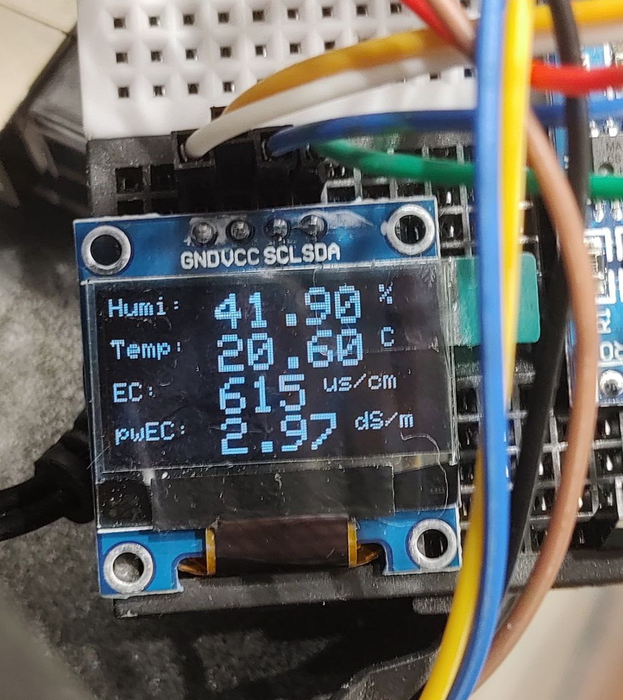
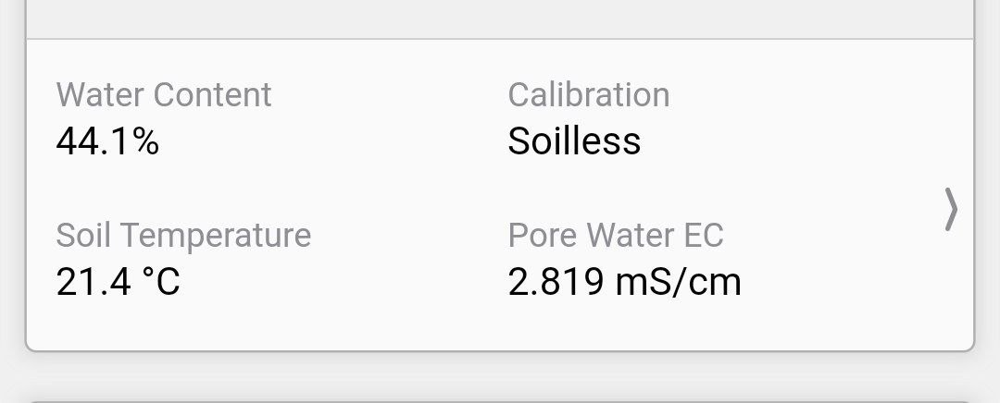
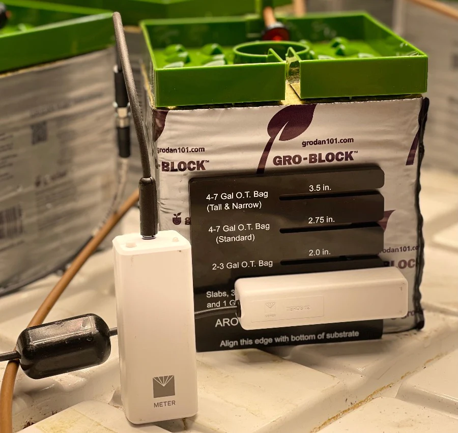

# Calibração e Medição de Sensores de Solo

Uma ferramenta para calibrar e medir pwEC com sensores TDR genéricos e Arduino.

## Índice

- [Introdução](#introdução)
  - [Dados e análise](#dados-e-análise)
- [Hardware](#hardware)
  - [Esquemática](#esquemática)
- [Software](#software)
- [Problemas Conhecidos](#problemas-conhecidos)
  - [Sensores de diferentes modelos e fabricantes](#sensores-de-diferentes-modelos-e-fabricantes)
  - [Medições entre diferentes sensores e locais](#medições-entre-diferentes-sensores-e-locais)
  - [Posição do sensor (ferramenta de alinhamento de sensor)](#posição-do-sensor)
  - [Uniformidade](#uniformidade)
- [Referências](#referências)
  - [Referências Sobre Crop Steering](#referências-sobre-crop-steering)

### Introdução

Este projeto surgiu da necessidade de utilizar sensores TDR genéricos para uso com [crop steering](#referências-sobre-crop-steering).

Na prática do _crop steering_, é muito comum o uso e medição do _pore water EC_ (pwEC), que é calculado a partir da 
medição da permissividade dielétrica
([mais à respeito](https://www.metergroup.com/en/meter-environment/measurement-insights/tdr-fdr-capacitance-compared)),
uma funcionalidade presente apenas em sensores profissionais mais caros, como o Teros 12 da Metergroup.

No nosso caso, gostaríamos de usar sensores de solo mais acessíveis e comparar as medições com um Teros 12 para
tentar encontrar alguma correlação nas medições.

#### Dados e análise

Para isso, registramos uma série de 30 medições de cada sensor em uma 
[planilha](https://docs.google.com/spreadsheets/d/1E9GSEiDYnn_6L7qgtjaymDu83J8WYE-xgDbja41ro9Q/) por aproximadamente
10 dias na tentativa de encontrar algum padrão.

Após alguma análise e com base em [alguns artigos](#referências), fizemos aproximações quadráticas e cúbicas com os 
dados usando o Matlab.

 

No fim parece que conseguimos encontrar uma calibração. Com uma diferença de precisão de VWC < 3% e bulk EC < 100 ppm, o 
que podemos considerar um resultado satisfatório:

_Leituras do sensor genérico com Arduino_

_Leituras do sensor Teros 12 com ZSC (spot check bluetooth) e o aplicativo Zentra_

  

_Leituras do sensor genérico com Arduino_

_Leituras do sensor Teros 12 com ZSC (spot check bluetooth) e o aplicativo Zentra_

### Hardware

Você precisará de um sensor de solo TDR que meça a temperatura, a umidade e a condutividade do solo (EC).

Foi utilizado um sensor de solo da marca [ComWinTop](http://www.comwintop.com/), modelo THC-S com interface RS485. Então 
leve em conta que toda a calibração foi feita com este sensor. Se você usar outros modelos de sensores ou de outros 
fabricantes, pode ser necessário recalibrar e ajustar o código-fonte (em breve iremos liberar um método e ferramentas para isso).

  

- [Sensor no AliExpress](https://pt.aliexpress.com/item/1005001524845572.html) (compre o modelo THC-S) 
- [Manual and software de leitura do sensor](https://wiki20210805.oss-cn-hongkong.aliyuncs.com/download/sensors/Smart_Agriculture/CWT%20soil%20sensor%20manual.zip)  
- [Adaptador USB/RS485](https://pt.aliexpress.com/item/33017179197.html) (Opcional. Se você quiser fazer medições de sensor com um PC com Windows via USB. Use esse adaptador específico. Outros modelos de adaptadores testados não funcionam!)  
- [Mais recursos sobre o sensor CWT](http://www.comwintop.com/index.php?s=index/category/index&id=144)  

Também vai precisar:
- Arduino à sua escolha (usamos o Arduino Uno).
- [Módulo bidirectional TTL to RS485 (MAX485) para Arduino](https://pt.aliexpress.com/item/32848382513.html).
- Protoboard.
- Cabos jumper.
- [Módulo de Display OLED](https://pt.aliexpress.com/item/1005004971492089.html) (opcional)

#### Esquemática

- O fio amarelo do sensor vai no conector `A` do módulo RS485. 
- O fio azul do sensor vai no conector `B` do módulo RS485. 
- O fio preto do sensor vai no GND do Arduino.
- O fio vermelho/marrom do sensor vai no 5V do Arduino.

### Software

Basta abrir o Arduino IDE, carregar o [soil_sensor.ino](src/soil_sensor.ino) no seu Arduino e observar o monitor serial 
(padrão `115200` baud).

Se deseja fazer verificações pontuais in loco que não necessitem de um computador para fazer as leituras, use um módulo 
de display do Arduino. Aqui usei um módulo de Diplay OLED Adafruit-like de 128x64 pixels. 
Veja o código-fonte [soil_sensor_display.ino](src/soil_sensor_display.ino).

### Problemas Conhecidos

#### Sensores de diferentes modelos e fabricantes

Como afirmado anteriormente, todos os cálculos e software apresentados aqui foram baseados em dois sensores específicos, 
o THC-S da ComWinTop e o Teros 12 da Metergroup.

Sabe-se que diferentes sensores do mesmo tipo tendem a ter medições muito próximas, pelo menos nos modelo profissionais 
mais precisos. Portanto, é possível que essas calibrações funcionem com muitos sensores TDR similares aos do CWT.

Porém, dado o menor grau de precisão, além de possivelmente serem sensores genéricos sem alto padrão de fabricação,
pode acontecer que as medições sejam muito diferentes do esperado. Nesse caso, tente fazer suas próprias medições e 
encontrar uma nova configuração de calibração, envie um PR e teremos prazer em testá-lo. Ou entre em contato para que 
possamos explorar melhor e tentar resolver problemas específicos de cada sensor.

#### Medições entre diferentes sensores e locais

O principal problema (talvez com todos os sensores) é a estabilidade do sensor no solo/substrato.

O sensor precisa ser inserido no substrato compactado (talvez por isso funcione melhor em lã de rocha) e evitar
o máximo possível mover ou remover o sensor do local.

Uma vez movido ou removido e posteriormente recolocado, há uma grande chance de que as medições fiquem diferentes. Então 
o maior desafio aqui é posicionar todos os sensores de forma que as medições fiquem muito próximas. É um trabalho chato, 
mas possível. Então seja paciente.

Além disso, diferentes sensores podem mostrar diferentes medições, dependendo da posição. No caso do CWT THC-S e
do Teros 12, sensores utilizados neste projeto, as medições foram feitas no mesmo pote/substrato com os sensores 
posicionados na mesma altura e alinhamento. Portanto, se você tomar esses cuidados, provavelmente terá medições muito 
próximas entre os sensores (veja mais abaixo).

#### Posição do sensor

As medições irão variar dependendo do posicionamento/altura do sensor, que irá variar dependendo do tipo e volume de substrato.
Para resolver esse problema, a Aroya desenvolveu uma ferramenta de alinhamento de sensores:

  

No entanto, não é necessário ter a ferramenta. Abaixo estão as recomendações de posição:

| Bags de coco e vasos de 4-7 galões (Alto e estreito) | Bags de coco e vasos de 4-7 galões (Padrão) | Bags de coco e vasos de 2-3 galões | Slabs, Blocos de lã de 3"-6", Bags de coco e vasos de 1 galão |
|------------------------------------------------------|--------------------------------------|----------------------------|---------------------------------------------------------------|
| 3,5 polegadas (~9 cm)                                | 2,75 polegadas (7 cm)                | 2,0 pol (5 cm)             | 1.25 pol (~3 cm)                                              |

Simplesmente meça com uma régua a partir da base do substrato (não necessariamente a base do vaso ou bag).

#### Uniformidade

Coco não é um substrato uniforme. Mesmo a lã de rocha não tem tanta uniformidade. Esse é o principal fator nas diferenças 
de medições causados pelo posicionamento do sensor.

Veja o Ramsey Nubani da Aroya falando mais sobre isso:

https://aroya.io/en/knowledge-base/crash-courses/uniformity

### Referências

- [[Meter Group] Soil moisture sensors - How they work](https://www.metergroup.com/en/meter-environment/measurement-insights/tdr-fdr-capacitance-compared)  
- [[Meter Group] Teros 11/12 Manual](assets/20587_TEROS11-12_Manual_Web.pdf)  
- [[Kameyama] Measurement of solid phase permittivity for volcanic soils by time domain reflectometry](assets/kameyama2008.pdf)  
- [[Gonçalves] Influência da densidade do solo na estimativa da umidade ... por meio da técnica de TDR](assets/nitossolo.pdf)  
- [[G. C. Topp] Electromagnetic Determination of Soil Water Content](assets/topp1980.pdf)  
- [[Yasser Hamed] Evaluation of the WET sensor compared to time domain reflectometry](assets/hamed.pdf)  
- [[Hilhorst] A Pore Water Conductivity Sensor](assets/hilhorst2000.pdf)  
- [[Gaskin] Measurement of Soil Water Content Using a Simplified Impedance Measuring Technique](assets/gaskin1996.pdf)

#### Referências sobre Crop Steering

- [[Aroya] Crop Steering - The Ultimate Guide](https://aroya.io/en/resources/crop-steering)
- [[Growlink] The Growlink Ultimate Guide to Crop Steering](https://www.growlink.com/crop-steering)
- [[Trym] Crop Steering Cannabis](https://trym.io/crop-steering-cannabis/)
- [[FloraFlex] Crop Steering Series](https://floraflex.com/default/how-to-grow/crop-steering)
- [[Aroya] Uniformity](https://aroya.io/en/knowledge-base/crash-courses/uniformity)